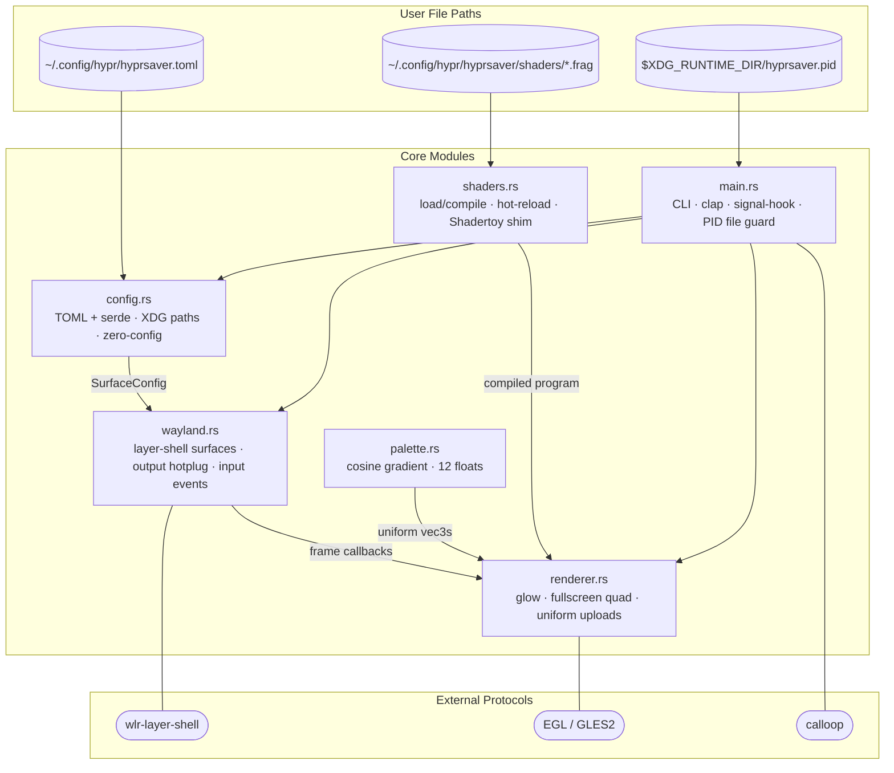

# hyprsaver

**A Wayland-native screensaver for Hyprland -- fractal shaders on wlr-layer-shell overlays**

[](https://github.com/maravexa/hyprsaver/actions)
[](https://crates.io/crates/hyprsaver)
[](https://aur.archlinux.org/packages/hyprsaver)
[](LICENSE)

---

## What is hyprsaver?

hyprsaver is a GPU-accelerated screensaver for [Hyprland](https://hyprland.org). It renders GLSL fragment shaders as fullscreen overlays on every connected monitor using the [wlr-layer-shell](https://wayland.app/protocols/wlr-layer-shell-unstable-v1) Wayland protocol -- a proper Wayland citizen, not a window hack.

It is designed to complement [hyprlock](https://github.com/hyprwm/hyprlock) and [hypridle](https://github.com/hyprwm/hypridle). Screensaver and lock screen are separate concerns: hyprsaver blankets your monitor with beautiful fractals, hypridle triggers it after a configurable idle timeout, and hyprlock handles authentication when you want to resume. Each tool does one thing well.

---


## Quick Start

### Arch Linux
```bash
yay -S hyprsaver
```

### Cargo Install
```bash
cargo install hyprsaver
```

## Manual Installation

1. Build and install:
   ```
   git clone https://github.com/maravexa/hyprsaver
   cd hyprsaver
   make install
   ```

2. Test it (launches screensaver immediately):
   ```
   hyprsaver
   ```
   Press any key or move the mouse to dismiss.

3. Add to your hypridle config (`~/.config/hypr/hypridle.conf`):
   ```ini
   listener {
       timeout = 600
       on-timeout = hyprsaver
       on-resume = hyprsaver --quit
   }
   ```

4. Customize (`~/.config/hypr/hyprsaver.toml`):
   ```toml
   [general]
   shader = "julia"
   palette = "vaporwave"

   [behavior]
   fade_in_ms = 800
   fade_out_ms = 400

   # Per-monitor overrides (run `hyprctl monitors` for output names)
   [[monitor]]
   name = "DP-1"
   shader = "donut"
   palette = "frost"
   ```

---

## Features (v0.3.0)

- **Wayland-native** via wlr-layer-shell -- not a window, a proper overlay surface
- **GPU-accelerated GLSL** fragment shaders via OpenGL ES (glow crate)
- **Multi-monitor** support -- one surface per output, with per-monitor shader/palette assignment via `[[monitor]]` config blocks
- **Cosine gradient palettes** -- 12 floats define smooth, infinite color ramps. Any shader x any palette
- **Shadertoy-compatible** shader format -- paste Shadertoy code with minimal edits, it just works
- **Hot-reload** shaders from `~/.config/hypr/hyprsaver/shaders/` -- edit, save, see the change instantly
- **Cycle mode** for shaders and palettes -- rotate through all or a named playlist on a configurable interval
- **Built-in shader collection** (20 shaders):

  | Name            | Description                                          |
  |-----------------|------------------------------------------------------|
  | `mandelbrot`    | Mandelbrot set with animated zoom                    |
  | `julia`         | Julia set with animated parameter                    |
  | `plasma`        | Classic plasma effect                                |
  | `tunnel`        | Infinite tunnel flythrough                           |
  | `voronoi`       | Animated Voronoi cells                               |
  | `snowfall`      | Five-layer parallax snowfall with palette dot glow   |
  | `starfield`     | Hyperspace zoom tunnel with motion-blur tracers      |
  | `kaleidoscope`  | 6-fold kaleidoscope driven by domain-warped FBM      |
  | `marble`        | Curl-noise flow field with 8-step particle tracing   |
  | `donut`         | Raymarched torus with Phong lighting and fog         |
  | `lissajous`     | Three overlapping Lissajous curves with glow         |
  | `geometry`      | Wireframe polyhedron morphing (cube→icosahedron→...) |
  | `hypercube`     | Rotating 4D tesseract projected to 2D, neon glow     |
  | `network`       | Neural network node graph with glowing connections   |
  | `matrix`        | Classic Matrix digital rain with procedural glyphs   |
  | `fire`          | Roiling procedural flames with ember particles       |
  | `caustics`      | Underwater caustic light patterns                    |
  | `bezier`        | Five animated Bézier curves with additive palette glow |
  | `planet`        | Raymarched planet sphere with aurora borealis bands and noise-perturbed curtains |
  | `tesla`         | Tesla coil arcs — fractal-lightning between three electrodes with branching |
- **Built-in palette collection**: rainbow, autumn, vaporwave, frost, ember, ocean, monochrome, sunset, aurora, midnight
- Configurable FPS and dismiss triggers
- **Preview mode** for shader authoring (`--preview <shader>`) with speed/zoom control panel
- **PID file based instance management** (`--quit` to signal a running instance)
- Zero-config: works with no config file, sensible defaults throughout
- Clean integration with hypridle and hyprlock

---

## Installation

### Build from Source

Requires the Rust stable toolchain, development headers for Wayland (`wayland-devel` / `libwayland-dev`), and EGL (`mesa-libEGL-devel` / `libegl-dev`).

```sh
git clone https://github.com/maravexa/hyprsaver
cd hyprsaver
make install          # builds release and installs to /usr/local/bin
```

Or manually:

```sh
cargo build --release
sudo install -Dm755 target/release/hyprsaver /usr/local/bin/hyprsaver
```

To install to a custom prefix:

```sh
make install PREFIX=/usr
```

To uninstall:

```sh
make uninstall
```

### AUR

```sh
yay -S hyprsaver
```

### Debian / Ubuntu

```bash
# Download the .deb from the latest release
sudo dpkg -i hyprsaver_0.3.0_amd64.deb
```

### Fedora / RHEL / openSUSE

```bash
# Download the .rpm from the latest release
sudo rpm -i hyprsaver-0.3.0-1.x86_64.rpm
```

### Nix / NixOS

A Nix flake is included in the repository root.

**Run without installing:**

```sh
nix run github:maravexa/hyprsaver
```

**Add to your NixOS / Home Manager flake:**

```nix
# flake.nix
{
  inputs = {
    nixpkgs.url = "github:NixOS/nixpkgs/nixos-unstable";
    hyprsaver.url = "github:maravexa/hyprsaver";
  };

  outputs = { self, nixpkgs, hyprsaver, ... }: {
    # NixOS system config:
    nixosConfigurations.myhostname = nixpkgs.lib.nixosSystem {
      modules = [
        ({ pkgs, ... }: {
          environment.systemPackages = [
            hyprsaver.packages.${pkgs.system}.default
          ];
        })
      ];
    };
  };
}
```

**Development shell** (includes Rust stable + rust-analyzer + clippy):

```sh
nix develop github:maravexa/hyprsaver
```

> **NixOS note**: `libGL` and `libEGL` are dlopen'd at runtime. The flake's
> `devShell` sets `LD_LIBRARY_PATH` automatically. If you run the installed
> binary outside the dev shell, wrap it with:
> ```sh
> LD_LIBRARY_PATH=$(nix eval --raw 'nixpkgs#mesa')/lib:$LD_LIBRARY_PATH hyprsaver
> ```
> or use `programs.hyprsaver.enable` once a NixOS module is added (planned for v1.0.0).

---

## Integration with Hyprland

Example configuration files for hypridle and hyprland are provided in the [`examples/`](examples/) directory.

### hypridle.conf

The recommended setup: hypridle triggers hyprsaver after 10 minutes of idle, then hyprlock after 20 minutes.

```ini
# ~/.config/hypridle/hypridle.conf

general {
    lock_cmd = hyprlock          # run hyprlock when the session is locked
    ignore_dbus_inhibit = false  # respect Wayland idle inhibitors (video players, etc.)
}

listener {
    timeout = 600                # 10 minutes -> start screensaver
    on-timeout = hyprsaver
    on-resume = hyprsaver --quit # dismiss screensaver when activity resumes
}

listener {
    timeout = 1200               # 20 minutes -> lock screen
    on-timeout = hyprlock
}
```

> **Note**: hypridle respects `org.freedesktop.ScreenSaver.Inhibit` (set by most video players and browsers during full-screen playback), so hyprsaver is automatically suppressed while you watch a film.

### hyprland.conf (optional hotkey)

```ini
# Start/stop the screensaver manually
bind = $mod, F12, exec, hyprsaver
bind = , escape, exec, hyprsaver --quit
```

---

## Configuration

The config file lives at `~/.config/hypr/hyprsaver.toml`. It is entirely optional -- hyprsaver runs with built-in defaults if no file exists.

> **Upgrading from v0.1.x?** The config path moved from `~/.config/hyprsaver/config.toml` to
> `~/.config/hypr/hyprsaver.toml` and the shader directory from `~/.config/hyprsaver/shaders/`
> to `~/.config/hypr/hyprsaver/shaders/`. The old paths are still recognised with a deprecation
> warning — move your files at your convenience.

A full annotated example is provided at [`examples/hyprsaver.toml`](examples/hyprsaver.toml).

### Minimal Config

```toml
[general]
shader = "julia"
palette = "vaporwave"
fps = 30
```

### Full Reference

```toml
[general]
fps = 30                          # render frame rate
shader = "cycle"                  # a shader name, "random", or "cycle" (default)
palette = "cycle"                 # a palette name, "random", or "cycle" (default)
shader_cycle_interval = 300       # seconds per shader when shader = "cycle"
palette_cycle_interval = 60       # seconds per palette when palette = "cycle"
cycle_order = "random"            # "random" (default) or "sequential"
synced = true                     # sync monitors in cycle mode (default: true)
shader_playlist = "default"       # playlist name for shader cycling
palette_playlist = "default"      # playlist name for palette cycling

[behavior]
fade_in_ms = 800               # fade-in duration
fade_out_ms = 400              # fade-out duration
dismiss_on = ["key", "mouse_move", "mouse_click", "touch"]

# Playlists group shaders and palettes together for cycle mode.
# "all" = all available shaders/palettes. If "default" is not defined, it
# implicitly expands to ["all"] for both.
[playlists.default]
shaders = ["all"]
palettes = ["all"]

[playlists.chill]
shaders = ["plasma", "marble", "bezier", "lissajous", "planet"]
palettes = ["vaporwave", "frost", "ocean", "aurora"]

# Custom palettes are defined as top-level [palettes.<name>] sections
[palettes.my_palette]
a = [0.5, 0.5, 0.5]
b = [0.5, 0.5, 0.5]
c = [1.0, 1.0, 1.0]
d = [0.00, 0.33, 0.67]
```

### Cycle Mode

By default, hyprsaver cycles through all shaders and palettes (`shader = "cycle"`, `palette = "cycle"`):

```toml
[general]
shader = "cycle"
shader_cycle_interval = 300   # advance every 5 minutes

palette = "cycle"
palette_cycle_interval = 60   # advance every minute

cycle_order = "random"        # "random" (default) or "sequential"
synced = true                 # all monitors cycle together (default)
```

To cycle only a subset, define a playlist and reference it:

```toml
[general]
shader = "cycle"
shader_playlist = "chill"

[playlists.chill]
shaders = ["snowfall", "starfield", "tunnel", "plasma"]
palettes = ["vaporwave", "frost", "ocean"]
```

On startup, cycle mode begins at a random position in the playlist so each session looks different. Use `--list-shader-playlists` or `--list-palette-playlists` to inspect defined playlists.

### Playlists

Playlists are named subsets used with cycle mode. Each playlist can contain both a `shaders` and `palettes` list. Define them under `[playlists]` and reference by name in `[general]`:

```toml
[general]
shader_playlist = "chill"      # use the "chill" playlist for shaders
palette_playlist = "chill"     # use the "chill" playlist for palettes

[playlists.default]
shaders = ["all"]              # "all" = every built-in + user shader
palettes = ["all"]

[playlists.chill]
shaders = ["plasma", "marble", "bezier", "lissajous", "planet"]
palettes = ["vaporwave", "frost", "ocean", "aurora"]

[playlists.intense]
shaders = ["mandelbrot", "julia", "tesla", "kaleidoscope", "fire"]
palettes = ["rainbow", "ember", "groovy"]
```

If the `"default"` playlist is not defined, it implicitly expands to `["all"]` for both shaders and palettes.

`shader_playlist` and `palette_playlist` can reference different playlists, or the same one.

Unknown shader or palette names in a playlist are skipped with a warning. If a playlist resolves to empty, all available shaders/palettes are cycled instead.

> **Upgrading from v0.3.0?** The separate `[shader_playlists.*]` and `[palette_playlists.*]` sections
> still work for backward compatibility. The new unified `[playlists.*]` format is preferred.

### Cosine Gradient Palettes

Palettes use Inigo Quilez's cosine gradient technique. The formula is:

```
color(t) = a + b * cos(2pi * (c * t + d))
```

where `a`, `b`, `c`, `d` are RGB vectors and `t` is in [0, 1].

- **a** -- average brightness (midpoint of the oscillation)
- **b** -- amplitude/contrast of each channel
- **c** -- frequency (1.0 = one hue cycle; 2.0 = two cycles)
- **d** -- phase shift (rotates each channel's hue independently)

Full mathematical background: [https://iquilezles.org/articles/palettes/](https://iquilezles.org/articles/palettes/)

---

## Writing Custom Shaders

Drop `.frag` files in `~/.config/hypr/hyprsaver/shaders/`. They are available immediately by filename stem (e.g. `my_effect.frag` -> `--shader my_effect`).

### Shader Format

hyprsaver shaders are GLSL ES 3.20 fragment shaders with these uniforms available:

```glsl
#version 320 es
precision highp float;

uniform float u_time;        // seconds since screensaver started
uniform vec2  u_resolution;  // physical pixel dimensions of the surface
uniform vec2  u_mouse;       // last mouse position (window-space pixels)
uniform int   u_frame;       // frame counter, starts at 0

// Cosine gradient palette -- set by the active palette config (v0.2.0+ names)
uniform vec3  u_palette_a_a;   // brightness
uniform vec3  u_palette_a_b;   // amplitude
uniform vec3  u_palette_a_c;   // frequency
uniform vec3  u_palette_a_d;   // phase
// LUT palette (texture units 1/2) and blend factor are also injected automatically
uniform sampler2D u_lut_a;
uniform int       u_use_lut;   // 0 = cosine, 1 = LUT
uniform float     u_palette_blend;

// Speed/zoom controls (preview panel drives these; daemon always sends 1.0)
uniform float u_speed_scale;
uniform float u_zoom_scale;

out vec4 fragColor;

// Palette helper -- included automatically, always available
// Signature unchanged from v0.1.x; implementation handles cosine + LUT modes
vec3 palette(float t);
```

### Minimal Example Shader

```glsl
#version 320 es
precision highp float;

uniform float u_time;
uniform vec2  u_resolution;
uniform float u_speed_scale;

out vec4 fragColor;

// palette() is injected automatically — no need to declare it yourself

void main() {
    vec2 uv = gl_FragCoord.xy / u_resolution;
    float t = length(uv - 0.5) * 3.0 - u_time * u_speed_scale * 0.5;
    fragColor = vec4(palette(fract(t)), 1.0);
}
```

### Shadertoy Compatibility

hyprsaver accepts shaders written in Shadertoy's convention. The following remappings are applied automatically:

| Shadertoy uniform | hyprsaver uniform |
|---|---|
| `iTime` | `u_time` |
| `iResolution` | `vec3(u_resolution, 0.0)` |
| `iMouse` | `vec4(u_mouse, 0.0, 0.0)` |
| `iFrame` | `u_frame` |

If your shader contains `void mainImage(out vec4 fragColor, in vec2 fragCoord)`, a `void main()` wrapper is appended automatically. You can paste most Shadertoy shaders directly (note: `iChannel` texture uniforms are not yet supported -- v1.0.0).

### Preview Mode — Control Panel

`--preview` opens a desktop window split into two regions:

- **Left**: live shader viewport
- **Right**: 280-px egui control panel

The panel provides:

| Control | Description |
|---------|-------------|
| **Shader** ComboBox | Switch to any built-in or user shader instantly |
| **Palette** ComboBox | Switch palette without restarting |
| **Speed** slider | 0.1× – 3.0× time multiplier (default 1.0) |
| **Zoom** slider | 0.1× – 3.0× zoom depth (fractal / starfield shaders) |
| **▶  Preview** button | Apply selected shader, palette, speed, and zoom |

Keyboard shortcuts always active in the preview window:

| Key | Action |
|-----|--------|
| `Q` / `Esc` | Quit preview |
| `R` | Force-reload current shader from disk |

> **Note:** Speed and zoom sliders only affect the preview window — the daemon always uses `u_speed_scale = 1.0` and `u_zoom_scale = 1.0` unless you add those uniforms to your own shader logic.

### Hot-Reload Workflow

```sh
# Open a live preview window
hyprsaver --preview my_shader

# In another terminal, edit the shader -- changes appear within one second
$EDITOR ~/.config/hypr/hyprsaver/shaders/my_shader.frag
```

Compile errors are logged to stderr; the last working shader continues running.

---

## Writing Custom Palettes

A palette is just four RGB vectors in TOML. Add them to `config.toml`:

```toml
[palettes.my_palette]
a = [0.5, 0.4, 0.3]   # midpoint brightness per channel
b = [0.5, 0.4, 0.3]   # oscillation amplitude
c = [1.0, 1.0, 0.5]   # frequency (0.5 = half a cycle for blue)
d = [0.00, 0.15, 0.30] # phase offset (shifts each channel's hue)
```

**Tips for palette design:**
- Keep `a + b <= 1.0` per channel to avoid clipping
- `d = [0.00, 0.33, 0.67]` evenly spaces RGB phases -> classic rainbow
- `c = [1.0, 1.0, 1.0]` means one full color cycle per sweep of `t`
- Low `b` values (e.g. `[0.2, 0.2, 0.2]`) produce subtle, pastel gradients
- `a = [0.8, 0.7, 0.6]`, `b = [0.2, 0.2, 0.2]` -> warm cream with gentle color hints

Palettes are tiny and easy to share -- post them as four TOML lines.

### Palette Tuning Workflow

For fast iteration when designing or tweaking palettes:

1. Launch hyprsaver in preview mode with any shader and your target palette:
   ```bash
   hyprsaver --preview julia --palette autumn
   ```

2. Edit your palette values in `~/.config/hypr/hyprsaver.toml`:
   ```toml
   [palettes.my_custom_palette]
   a = [0.5, 0.3, 0.2]
   b = [0.5, 0.4, 0.3]
   c = [1.0, 1.0, 1.0]
   d = [0.0, 0.1, 0.2]
   ```

3. Hot-reload picks up config changes automatically — save the file and the
   palette updates live on screen. No restart needed.

The cosine palette formula is `color(t) = a + b × cos(2π × (c × t + d))`.
Each channel ranges from `a - b` (minimum) to `a + b` (maximum). Adjust `d`
values to control where each color channel peaks relative to the others.
For a deeper explanation, see
[Inigo Quilez's palette article](https://iquilezles.org/articles/palettes/).

---

## CLI Reference

```
hyprsaver [OPTIONS]

OPTIONS:
    -c, --config <PATH>              Path to config file (overrides XDG default)
    -s, --shader <NAME>              Shader to use (name, "random", or "cycle")
    -p, --palette <NAME>             Palette to use (name, "random", or "cycle")
        --shader-cycle-interval <N>  Override shader cycle interval (seconds)
        --shader-interval <N>        Shorter alias for --shader-cycle-interval
        --palette-cycle-interval <N> Override palette cycle interval (seconds)
        --palette-interval <N>       Shorter alias for --palette-cycle-interval
        --cycle-order <ORDER>        Cycle order: "random" (default) or "sequential"
        --synced                     All monitors cycle in sync (default)
        --no-synced                  Each monitor cycles independently
        --playlist <NAME>            Set both shader and palette playlist by name
        --list-shaders               Print all available shader names and exit
        --list-palettes              Print all available palette names and exit
        --list-shader-playlists      Print all defined shader playlists and exit
        --list-palette-playlists     Print all defined palette playlists and exit
        --quit                       Send SIGTERM to the running hyprsaver instance
        --preview                    Open a windowed preview (combine with --shader)
    -v, --verbose                    Enable debug logging (RUST_LOG=hyprsaver=debug)
    -h, --help                       Print help
    -V, --version                    Print version
```

**Examples:**

```sh
# Start with a specific shader and palette
hyprsaver --shader julia --palette vaporwave

# Cycle through all shaders every 2 minutes
hyprsaver --shader cycle --shader-interval 120

# Cycle through a specific playlist
hyprsaver --shader cycle --playlist chill

# Cycle sequentially instead of randomly
hyprsaver --shader cycle --cycle-order sequential

# Each monitor cycles independently
hyprsaver --no-synced

# Preview a custom shader while editing it
hyprsaver --preview --shader my_shader

# See what's available
hyprsaver --list-shaders
hyprsaver --list-palettes
hyprsaver --list-shader-playlists

# Dismiss the running screensaver (e.g. from a hotkey)
hyprsaver --quit
```

---

## Architecture

hyprsaver is structured as four independent layers that communicate through clean interfaces:

<details>
<summary>Architecture</summary>



</details>

`renderer.rs` knows nothing about Wayland. `wayland.rs` knows nothing about OpenGL. `shaders.rs` knows nothing about palettes at upload time -- it only prepends the GLSL `palette()` function. This makes each layer independently testable and replaceable (the wgpu backend in v0.4.0 only needs to replace `renderer.rs`).

---

## Roadmap

### Shipped in v0.3.0

- 6 new built-in shaders: geometry, hypercube, network, matrix, fire, caustics
- Cycle mode for shaders and palettes with configurable intervals (`shader_cycle_interval`, `palette_cycle_interval`)
- Named playlists for shader and palette cycling (`[shader_playlists.*]`, `[palette_playlists.*]`)
- CLI flags: `--shader-cycle-interval`, `--palette-cycle-interval`, `--list-shader-playlists`, `--list-palette-playlists`
- Shader descriptions in `--list-shaders` output
- Cycle mode starts at a random position; both monitors stay in sync during transitions

### v0.4.0
- Per-monitor shader/palette assignment
- ~~Screencopy texture pipeline (sample the desktop as a shader input)~~
- ~~Rain-on-glass shader with real blurred desktop background~~
- Palette crossfade transitions on cycle

### v0.5.0
- Screencopy pipeline
- Rain-on-Glass shader
- Wormhole shader (fly-through curving tunnel, rewrite from scratch)

### v1.0.0
- Stable install story
- Stable config format -- no breaking changes after this
- Comprehensive curated shader library (20+ shaders)
- Full Shadertoy uniform support: `iChannel` textures, `iDate`, `iSampleRate`
- Comprehensive documentation and shader authoring guide

---

## Contributing

Contributions are welcome. Fork, create a branch, submit a pull request.

**Shader and palette contributions have the lowest barrier to entry** -- a new built-in shader is just a `.frag` file plus an entry in `shaders.rs`. A new palette is four lines of TOML and a constant in `palette.rs`. If you've made something beautiful, please share it.

For larger contributions, open an issue first to discuss the approach.

Before submitting:
```sh
cargo fmt
cargo clippy -- -D warnings
cargo test
```

---

## License

MIT -- see [LICENSE](LICENSE).

---

## Acknowledgments

- **[Inigo Quilez](https://iquilezles.org/)** -- for the cosine gradient palette technique and for [Shadertoy](https://www.shadertoy.com), the best shader playground in existence. The smooth iteration coloring in `mandelbrot.frag` is also his technique.
- **[Hyprland](https://hyprland.org)** and the [hyprwm](https://github.com/hyprwm) ecosystem (hyprlock, hypridle) -- for building a compositor worth building screensavers for.
- **[wlr-protocols](https://gitlab.freedesktop.org/wlroots/wlr-protocols)** -- for `zwlr_layer_shell_v1`, which makes proper Wayland screensavers possible.
- **[smithay](https://github.com/Smithay/smithay)** -- for smithay-client-toolkit, the best Rust Wayland client toolkit.
- **[glow](https://github.com/grovesNL/glow)** -- for a sane OpenGL abstraction that doesn't require unsafe everywhere.
