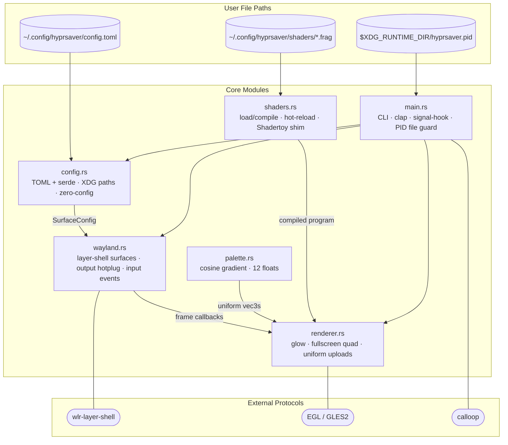

# hyprsaver

**A Wayland-native screensaver for Hyprland -- fractal shaders on wlr-layer-shell overlays**

[](https://github.com/maravexa/hyprsaver/actions)
[](https://crates.io/crates/hyprsaver)
[](https://aur.archlinux.org/packages/hyprsaver)
[](LICENSE)

---

## What is hyprsaver?

hyprsaver is a GPU-accelerated screensaver for [Hyprland](https://hyprland.org). It renders GLSL fragment shaders as fullscreen overlays on every connected monitor using the [wlr-layer-shell](https://wayland.app/protocols/wlr-layer-shell-unstable-v1) Wayland protocol -- a proper Wayland citizen, not a window hack.

It is designed to complement [hyprlock](https://github.com/hyprwm/hyprlock) and [hypridle](https://github.com/hyprwm/hypridle). Screensaver and lock screen are separate concerns: hyprsaver blankets your monitor with beautiful fractals, hypridle triggers it after a configurable idle timeout, and hyprlock handles authentication when you want to resume. Each tool does one thing well.

---


## Quick Start

### Debian / Ubuntu
```bash
# Download the .deb from the latest release
sudo dpkg -i hyprsaver_0.1.0_amd64.deb
```

### Fedora / RHEL / openSUSE
```bash
# Download the .rpm from the latest release
sudo rpm -i hyprsaver-0.1.0-1.x86_64.rpm
```

### Arch Linux
```bash
# Download the .tar.zst from the latest release
sudo pacman -U hyprsaver-0.1.0-x86_64-linux.tar.zst
```

## Manual Installation

1. Build and install:
   ```
   git clone https://github.com/maravexa/hyprsaver
   cd hyprsaver
   make install
   ```

2. Test it (launches screensaver immediately):
   ```
   hyprsaver
   ```
   Press any key or move the mouse to dismiss.

3. Add to your hypridle config (`~/.config/hypr/hypridle.conf`):
   ```ini
   listener {
       timeout = 600
       on-timeout = hyprsaver
       on-resume = hyprsaver --quit
   }
   ```

4. Customize (`~/.config/hyprsaver/config.toml`):
   ```toml
   [general]
   shader = "julia"
   palette = "vapor"
   ```

---

## Features (v0.1.0)

- **Wayland-native** via wlr-layer-shell -- not a window, a proper overlay surface
- **GPU-accelerated GLSL** fragment shaders via OpenGL ES (glow crate)
- **Multi-monitor** support -- one surface per output, all run simultaneously
- **Cosine gradient palettes** -- 12 floats define smooth, infinite color ramps. Any shader x any palette
- **Shadertoy-compatible** shader format -- paste Shadertoy code with minimal edits, it just works
- **Hot-reload** shaders from `~/.config/hyprsaver/shaders/` -- edit, save, see the change instantly
- **Built-in shader collection** (10 shaders):

  | Name            | Description                                        |
  |-----------------|----------------------------------------------------|
  | `mandelbrot`    | Mandelbrot set with animated zoom                  |
  | `julia`         | Julia set with animated parameter                  |
  | `plasma`        | Classic plasma effect                              |
  | `tunnel`        | Infinite tunnel flythrough                         |
  | `voronoi`       | Animated Voronoi cells                             |
  | `starfield`     | Three-layer parallax starfield with palette glow   |
  | `kaleidoscope`  | 6-fold kaleidoscope driven by domain-warped FBM    |
  | `flow_field`    | Curl-noise flow field with 8-step particle tracing |
  | `raymarcher`    | Raymarched torus with Phong lighting and fog       |
  | `lissajous`     | Three overlapping Lissajous curves with glow       |
- **Built-in palette collection**: electric, autumn, vapor, frost, ember, ocean, monochrome
- Configurable FPS and dismiss triggers
- **Preview mode** for shader authoring (`--preview <shader>`)
- **PID file based instance management** (`--quit` to signal a running instance)
- Zero-config: works with no config file, sensible defaults throughout
- Clean integration with hypridle and hyprlock

---

## Installation

### Build from Source

Requires the Rust stable toolchain, development headers for Wayland (`wayland-devel` / `libwayland-dev`), and EGL (`mesa-libEGL-devel` / `libegl-dev`).

```sh
git clone https://github.com/maravexa/hyprsaver
cd hyprsaver
make install          # builds release and installs to /usr/local/bin
```

Or manually:

```sh
cargo build --release
sudo install -Dm755 target/release/hyprsaver /usr/local/bin/hyprsaver
```

To install to a custom prefix:

```sh
make install PREFIX=/usr
```

To uninstall:

```sh
make uninstall
```

### AUR (planned)

```sh
paru -S hyprsaver  # or yay, or manual makepkg
```

### Nix Flake (planned)

```nix
inputs.hyprsaver.url = "github:maravexa/hyprsaver";
```

---

## Integration with Hyprland

Example configuration files for hypridle and hyprland are provided in the [`examples/`](examples/) directory.

### hypridle.conf

The recommended setup: hypridle triggers hyprsaver after 10 minutes of idle, then hyprlock after 20 minutes.

```ini
# ~/.config/hypridle/hypridle.conf

general {
    lock_cmd = hyprlock          # run hyprlock when the session is locked
    ignore_dbus_inhibit = false  # respect Wayland idle inhibitors (video players, etc.)
}

listener {
    timeout = 600                # 10 minutes -> start screensaver
    on-timeout = hyprsaver
    on-resume = hyprsaver --quit # dismiss screensaver when activity resumes
}

listener {
    timeout = 1200               # 20 minutes -> lock screen
    on-timeout = hyprlock
}
```

> **Note**: hypridle respects `org.freedesktop.ScreenSaver.Inhibit` (set by most video players and browsers during full-screen playback), so hyprsaver is automatically suppressed while you watch a film.

### hyprland.conf (optional hotkey)

```ini
# Start/stop the screensaver manually
bind = $mod, F12, exec, hyprsaver
bind = , escape, exec, hyprsaver --quit
```

---

## Configuration

The config file lives at `~/.config/hyprsaver/config.toml`. It is entirely optional -- hyprsaver runs with built-in defaults if no file exists.

A full annotated example is provided at [`config.example.toml`](config.example.toml) and [`examples/config.toml`](examples/config.toml).

### Minimal Config

```toml
[general]
shader = "julia"
palette = "vapor"
fps = 60
```

### Full Reference

```toml
[general]
fps = 30                       # render frame rate
shader = "mandelbrot"          # or "random", "cycle", or a custom name
palette = "electric"           # or "random", "cycle", or a custom name
shader_cycle_interval = 300    # seconds per shader when shader = "cycle"
palette_cycle = ["frost", "ocean", "electric", "ember"]  # month-indexed

[behavior]
fade_in_ms = 800               # fade-in duration (not yet implemented in v0.1.0)
fade_out_ms = 400              # fade-out duration (not yet implemented in v0.1.0)
dismiss_on = ["key", "mouse_move", "mouse_click", "touch"]

# Custom palettes are defined as top-level [palettes.<name>] sections
[palettes.my_palette]
a = [0.5, 0.5, 0.5]
b = [0.5, 0.5, 0.5]
c = [1.0, 1.0, 1.0]
d = [0.00, 0.33, 0.67]
```

### Cosine Gradient Palettes

Palettes use Inigo Quilez's cosine gradient technique. The formula is:

```
color(t) = a + b * cos(2pi * (c * t + d))
```

where `a`, `b`, `c`, `d` are RGB vectors and `t` is in [0, 1].

- **a** -- average brightness (midpoint of the oscillation)
- **b** -- amplitude/contrast of each channel
- **c** -- frequency (1.0 = one hue cycle; 2.0 = two cycles)
- **d** -- phase shift (rotates each channel's hue independently)

Full mathematical background: [https://iquilezles.org/articles/palettes/](https://iquilezles.org/articles/palettes/)

---

## Writing Custom Shaders

Drop `.frag` files in `~/.config/hyprsaver/shaders/`. They are available immediately by filename stem (e.g. `my_effect.frag` -> `--shader my_effect`).

### Shader Format

hyprsaver shaders are GLSL ES 3.20 fragment shaders with these uniforms available:

```glsl
#version 320 es
precision highp float;

uniform float u_time;        // seconds since screensaver started
uniform vec2  u_resolution;  // physical pixel dimensions of the surface
uniform vec2  u_mouse;       // last mouse position (window-space pixels)
uniform int   u_frame;       // frame counter, starts at 0

// Cosine gradient palette -- set by the active palette config
uniform vec3  u_palette_a;
uniform vec3  u_palette_b;
uniform vec3  u_palette_c;
uniform vec3  u_palette_d;

out vec4 fragColor;

// Palette helper -- included automatically, always available
vec3 palette(float t) {
    return u_palette_a + u_palette_b * cos(6.28318 * (u_palette_c * t + u_palette_d));
}
```

### Minimal Example Shader

```glsl
#version 320 es
precision highp float;

uniform float u_time;
uniform vec2  u_resolution;
uniform vec3  u_palette_a, u_palette_b, u_palette_c, u_palette_d;

out vec4 fragColor;

vec3 palette(float t) {
    return u_palette_a + u_palette_b * cos(6.28318 * (u_palette_c * t + u_palette_d));
}

void main() {
    vec2 uv = gl_FragCoord.xy / u_resolution;
    float t = length(uv - 0.5) * 3.0 - u_time * 0.5;
    fragColor = vec4(palette(fract(t)), 1.0);
}
```

### Shadertoy Compatibility

hyprsaver accepts shaders written in Shadertoy's convention. The following remappings are applied automatically:

| Shadertoy uniform | hyprsaver uniform |
|---|---|
| `iTime` | `u_time` |
| `iResolution` | `vec3(u_resolution, 0.0)` |
| `iMouse` | `vec4(u_mouse, 0.0, 0.0)` |
| `iFrame` | `u_frame` |

If your shader contains `void mainImage(out vec4 fragColor, in vec2 fragCoord)`, a `void main()` wrapper is appended automatically. You can paste most Shadertoy shaders directly (note: `iChannel` texture uniforms are not yet supported -- v1.0.0).

### Hot-Reload Workflow

```sh
# Open a live preview window
hyprsaver --preview my_shader

# In another terminal, edit the shader -- changes appear within one second
$EDITOR ~/.config/hyprsaver/shaders/my_shader.frag
```

Compile errors are logged to stderr; the last working shader continues running.

---

## Writing Custom Palettes

A palette is just four RGB vectors in TOML. Add them to `config.toml`:

```toml
[palettes.my_palette]
a = [0.5, 0.4, 0.3]   # midpoint brightness per channel
b = [0.5, 0.4, 0.3]   # oscillation amplitude
c = [1.0, 1.0, 0.5]   # frequency (0.5 = half a cycle for blue)
d = [0.00, 0.15, 0.30] # phase offset (shifts each channel's hue)
```

**Tips for palette design:**
- Keep `a + b <= 1.0` per channel to avoid clipping
- `d = [0.00, 0.33, 0.67]` evenly spaces RGB phases -> classic rainbow
- `c = [1.0, 1.0, 1.0]` means one full color cycle per sweep of `t`
- Low `b` values (e.g. `[0.2, 0.2, 0.2]`) produce subtle, pastel gradients
- `a = [0.8, 0.7, 0.6]`, `b = [0.2, 0.2, 0.2]` -> warm cream with gentle color hints

Palettes are tiny and easy to share -- post them as four TOML lines.

### Palette Tuning Workflow

For fast iteration when designing or tweaking palettes, use the included test shader:

1. Copy the test shader to your user shader directory:
   ```bash
   mkdir -p ~/.config/hyprsaver/shaders
   cp examples/palette_test.frag ~/.config/hyprsaver/shaders/
   ```

2. Launch hyprsaver with the test shader and your target palette:
   ```bash
   hyprsaver --shader palette_test --palette autumn
   ```

   The top portion of the screen shows the full palette as a horizontal gradient.
   The bottom shows the palette applied to a ring pattern, simulating how it
   looks on fractal geometry.

3. Edit your palette values in `~/.config/hyprsaver/config.toml`:
   ```toml
   [palettes.my_custom_palette]
   a = [0.5, 0.3, 0.2]
   b = [0.5, 0.4, 0.3]
   c = [1.0, 1.0, 1.0]
   d = [0.0, 0.1, 0.2]
   ```

4. Hot-reload picks up config changes automatically — save the file and the
   palette updates live on screen. No restart needed.

The cosine palette formula is `color(t) = a + b × cos(2π × (c × t + d))`.
Each channel ranges from `a - b` (minimum) to `a + b` (maximum). Adjust `d`
values to control where each color channel peaks relative to the others.
For a deeper explanation, see
[Inigo Quilez's palette article](https://iquilezles.org/articles/palettes/).

---

## CLI Reference

```
hyprsaver [OPTIONS]

OPTIONS:
    -c, --config <PATH>       Path to config file (overrides XDG default)
    -s, --shader <NAME>       Shader to use (name, "random", or "cycle")
    -p, --palette <NAME>      Palette to use (name, "random", or "cycle")
        --list-shaders        Print all available shader names and exit
        --list-palettes       Print all available palette names and exit
        --quit                Send SIGTERM to the running hyprsaver instance
        --preview <SHADER>    Open a windowed preview of the named shader
    -v, --verbose             Enable debug logging (RUST_LOG=hyprsaver=debug)
    -h, --help                Print help
    -V, --version             Print version
```

**Examples:**

```sh
# Start with a specific shader and palette
hyprsaver --shader julia --palette vapor

# Preview a custom shader while editing it
hyprsaver --preview my_shader

# See what's available
hyprsaver --list-shaders
hyprsaver --list-palettes

# Dismiss the running screensaver (e.g. from a hotkey)
hyprsaver --quit
```

---

## Architecture

hyprsaver is structured as four independent layers that communicate through clean interfaces:

<details>
<summary>Architecture</summary>



</details>

`renderer.rs` knows nothing about Wayland. `wayland.rs` knows nothing about OpenGL. `shaders.rs` knows nothing about palettes at upload time -- it only prepends the GLSL `palette()` function. This makes each layer independently testable and replaceable (the wgpu backend in v0.4.0 only needs to replace `renderer.rs`).

---

## Roadmap

### v0.2.0
- LUT palettes: 256-color tables from PNG strips or inline hex arrays
- CSS-style gradient-stop palettes (interpolated to LUT at load time)
- Per-monitor shader and palette assignment in config
- Palette transition animations (smooth crossfade when cycling palettes)

### v0.3.0
- Audio reactivity via PipeWire (FFT frequency bands -> shader uniforms)
- Interactive mode: mouse position -> shader uniforms (for ambient desktop use, not just screensaver)
- MPRIS integration: album art dominant color extraction -> automatic palette

### v0.4.0
- wgpu backend option (Vulkan via wgpu for broader GPU compatibility and future-proofing)
- Shader parameter GUI (small GTK4 or Slint panel for live-tuning palette vectors)
- Community shader and palette repository integration

### v1.0.0
- AUR and Nix packages, stable install story
- Stable config format -- no breaking changes after this
- Comprehensive curated shader library (20+ shaders)
- Full Shadertoy uniform support: `iChannel` textures, `iDate`, `iSampleRate`
- Comprehensive documentation and shader authoring guide

---

## Contributing

Contributions are welcome. Fork, create a branch, submit a pull request.

**Shader and palette contributions have the lowest barrier to entry** -- a new built-in shader is just a `.frag` file plus an entry in `shaders.rs`. A new palette is four lines of TOML and a constant in `palette.rs`. If you've made something beautiful, please share it.

For larger contributions, open an issue first to discuss the approach.

Before submitting:
```sh
cargo fmt
cargo clippy -- -D warnings
cargo test
```

---

## License

MIT -- see [LICENSE](LICENSE).

---

## Acknowledgments

- **[Inigo Quilez](https://iquilezles.org/)** -- for the cosine gradient palette technique and for [Shadertoy](https://www.shadertoy.com), the best shader playground in existence. The smooth iteration coloring in `mandelbrot.frag` is also his technique.
- **[Hyprland](https://hyprland.org)** and the [hyprwm](https://github.com/hyprwm) ecosystem (hyprlock, hypridle) -- for building a compositor worth building screensavers for.
- **[wlr-protocols](https://gitlab.freedesktop.org/wlroots/wlr-protocols)** -- for `zwlr_layer_shell_v1`, which makes proper Wayland screensavers possible.
- **[smithay](https://github.com/Smithay/smithay)** -- for smithay-client-toolkit, the best Rust Wayland client toolkit.
- **[glow](https://github.com/grovesNL/glow)** -- for a sane OpenGL abstraction that doesn't require unsafe everywhere.
